- [1. Steps to reproduce the results](#1-steps-to-reproduce-the-results)
  - [1.1. Need docker?](#11-need-docker)
    - [1.1.1. Download the docker image by](#111-download-the-docker-image-by)
    - [1.1.2. Run the docker](#112-run-the-docker)
  - [1.2. ROS](#12-ros)
    - [1.2.1. demo](#121-demo)
    - [1.2.2. rqt\_graph](#122-rqt_graph)
- [2. Code interpretation](#2-code-interpretation)
  - [2.1. what is frame](#21-what-is-frame)
- [3. inherit from vins-mono](#3-inherit-from-vins-mono)
  - [3.1. reducevector](#31-reducevector)
  - [3.2.](#32)
- [4. Sensor Charactoristic/Front end](#4-sensor-charactoristicfront-end)
  - [4.1. Radar](#41-radar)
    - [4.1.1. /radar\_frame](#411-radar_frame)
  - [4.2. what is row\_step](#42-what-is-row_step)
  - [4.3.](#43)
  - [4.4. IMU](#44-imu)
- [5. Back end/Optimization](#5-back-endoptimization)
- [6. Output Data Extraction](#6-output-data-extraction)
  - [6.1. map](#61-map)
    - [6.1.1. /sub\_map\_frame](#611-sub_map_frame)
    - [6.1.2. /tracking\_frame](#612-tracking_frame)
      - [6.1.2.1. Is /tracking\_frame the overlap of the current frame with sub\_map?](#6121-is-tracking_frame-the-overlap-of-the-current-frame-with-sub_map)
      - [6.1.2.2. Is radarFeatureFactor.pointRelation contains each point from the current frame, where the point without match turns out to be zeros-match?](#6122-is-radarfeaturefactorpointrelation-contains-each-point-from-the-current-frame-where-the-point-without-match-turns-out-to-be-zeros-match)
  - [6.2. Pose](#62-pose)
    - [6.2.1. /estimated\_pose (world to inertial frame)](#621-estimated_pose-world-to-inertial-frame)
    - [6.2.2. rio](#622-rio)
- [7. Issue](#7-issue)
  - [7.1. ERROR: Unable to start XML-RPC server, port 11311 is already in use (just occasionally occurs)](#71-error-unable-to-start-xml-rpc-server-port-11311-is-already-in-use-just-occasionally-occurs)
  - [z error is very large](#z-error-is-very-large)
  - [7.2. Bug](#72-bug)
    - [7.2.1. the rio msg is strange,  always being jumping](#721-the-rio-msg-is-strange--always-being-jumping)
    - [7.2.2. the header timestamp of radar\_frame is wrong](#722-the-header-timestamp-of-radar_frame-is-wrong)

# 1. Steps to reproduce the results
## 1.1. Need docker?
###  1.1.1. Download the docker image by 
```
bash docker.sh -b
```
(then, it start download the file and build
```
function build() {
    docker build \
    -t rio \
    -f $SCRIPT_DIR/Dockerfile \
    $SCRIPT_DIR/..
}
```
)
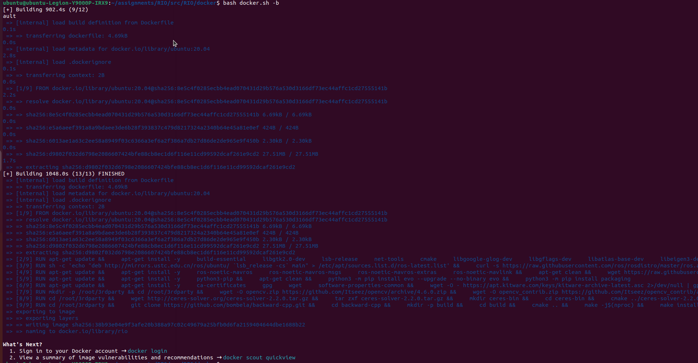


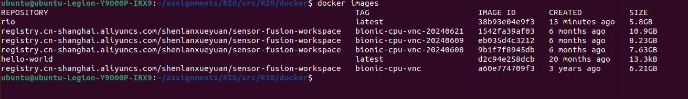

### 1.1.2. Run the docker 
```
bash docker.sh -r
```

*This starts the Docker container and attaches your terminal to it. Once the container starts successfully, the terminal will switch to being inside the Docker container.*

(mapping the current folder to docker 
```
function run() {
    docker run -it --rm \
    --network host \
    --privileged \
    -v /dev:/dev \
    -v $SCRIPT_DIR/../:/ws/src \
    -e DISPLAY=$DISPLAY \
    -v /tmp/.X11-unix:/tmp/.X11-unix \
    rio \
    /bin/bash
}
```
)

## 1.2. ROS
bash 1

```
roscore &
rviz -d rio/config/RIO.rviz
```

bash 2
```
python3 /ws/src/docker/run.py -a -n rio -c /ws/src/rio/config/ars548.yaml -d /ws/src/dataset/exp/Sequence_1.bag -r 1 -p 1
```
### 1.2.1. demo

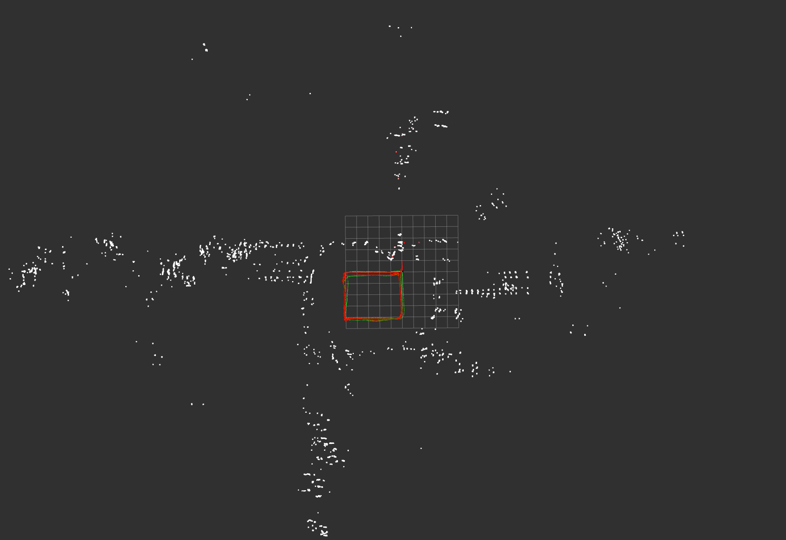
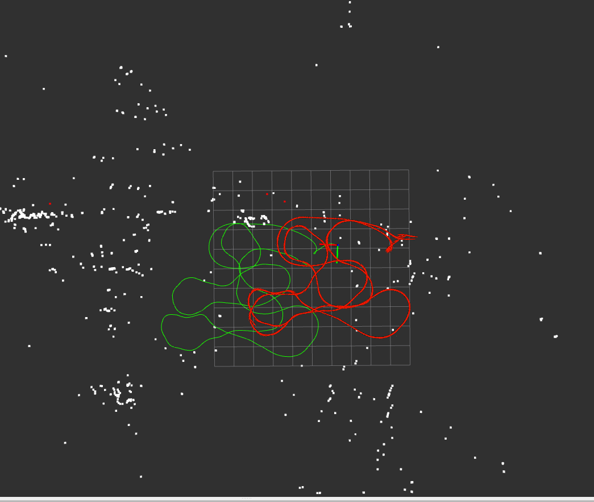
### 1.2.2. rqt_graph 

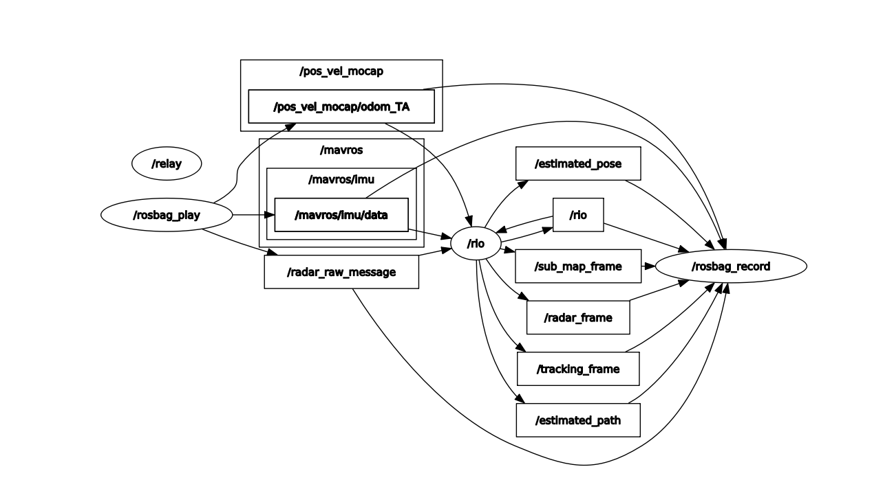


# 2. Code interpretation
## 2.1. what is frame 
```
  frame = scan2scanTracker.trackPoints(frameRadarData, timeStamp);

  radarData.data.emplace_back(frame);
```

# 3. inherit from vins-mono
## 3.1. reducevector
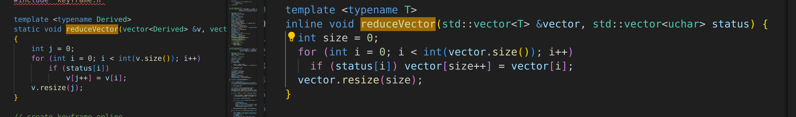

## 3.2. 

# 4. Sensor Charactoristic/Front end
## 4.1. Radar

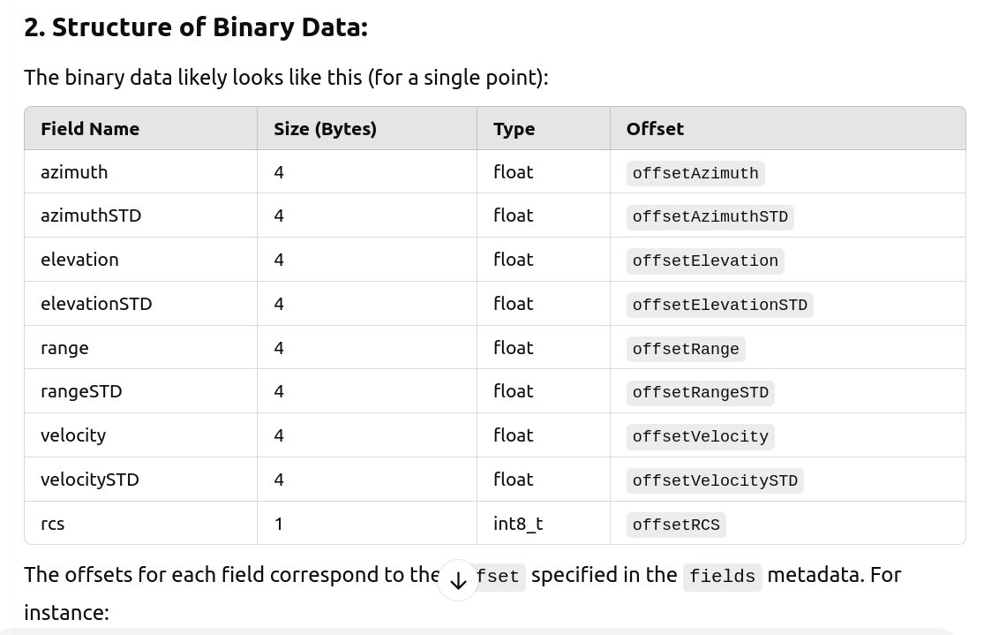

### 4.1.1. /radar_frame
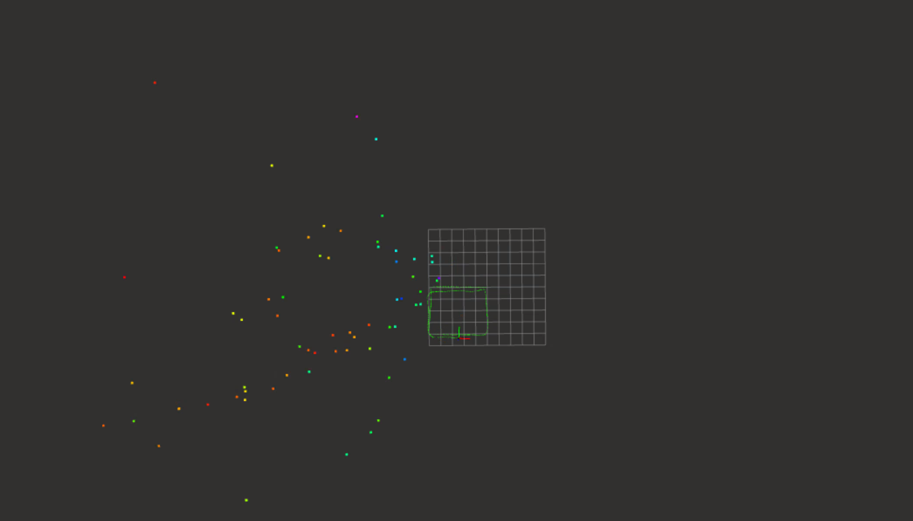

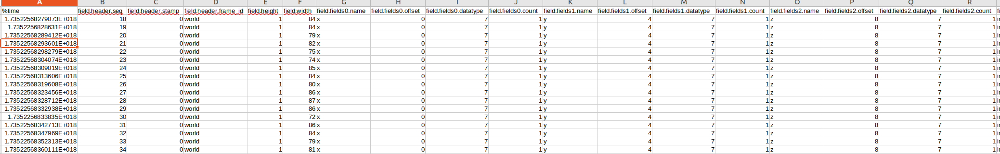

angle seems to be [-60, 60]x[-20, 20]

## 4.2. what is row_step
it is how many points there are in a single frame.

## 4.3. 

## 4.4. IMU

# 5. Back end/Optimization

# 6. Output Data Extraction
## 6.1. map 
### 6.1.1. /sub_map_frame

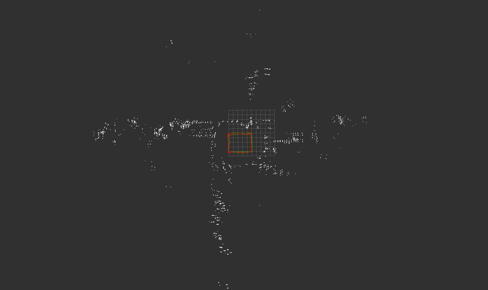

### 6.1.2. /tracking_frame
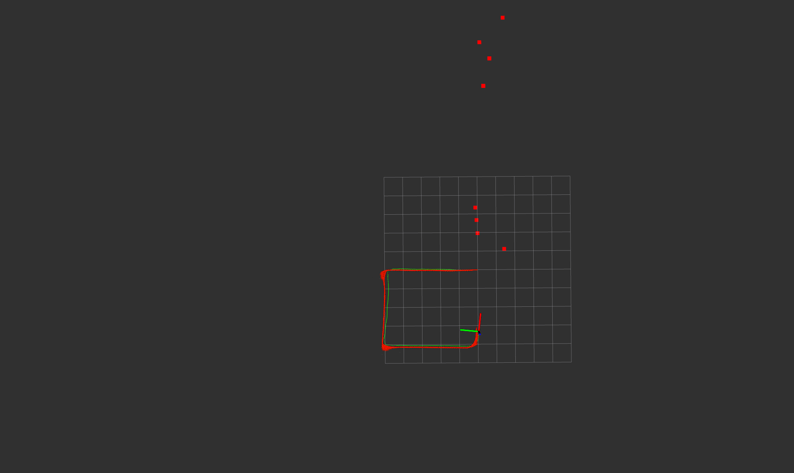
#### 6.1.2.1. Is /tracking_frame the overlap of the current frame with sub_map?
Yes
#### 6.1.2.2. Is radarFeatureFactor.pointRelation contains each point from the current frame, where the point without match turns out to be zeros-match?
Likely

## 6.2. Pose
### 6.2.1. /estimated_pose (world to inertial frame)


### 6.2.2. rio
seems to be groundtruth, the same name as node name


 


# 7. Issue
## 7.1. ERROR: Unable to start XML-RPC server, port 11311 is already in use (just occasionally occurs)

```
roscore -p 11312
```

```
export ROS_MASTER_URI=http://localhost:11312
```

## z error is very large
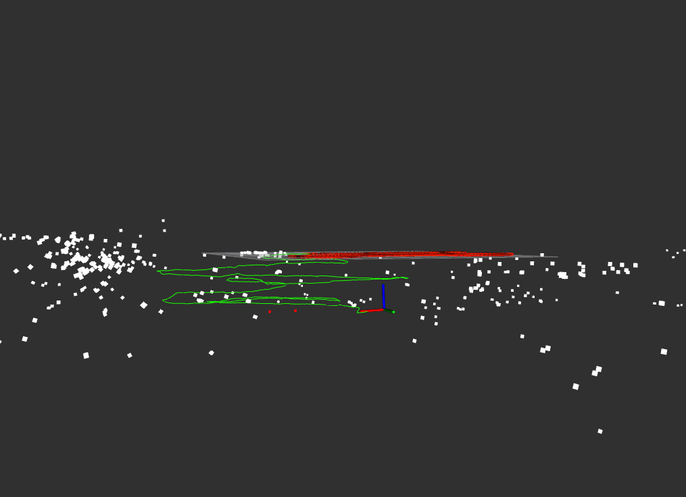
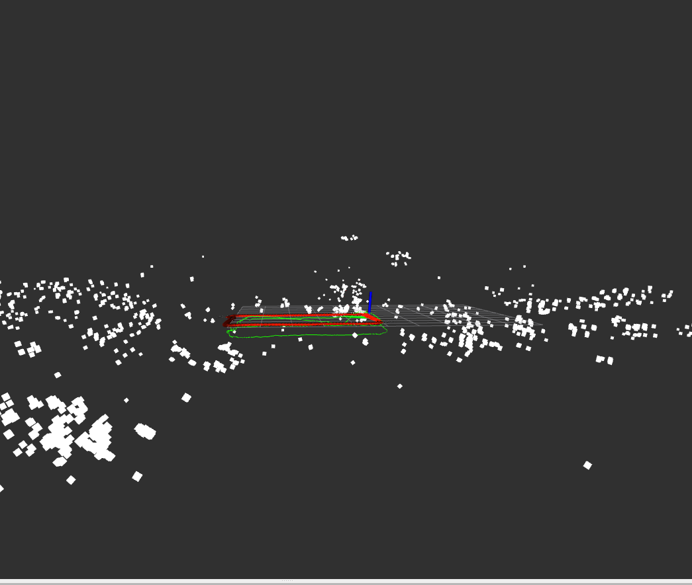
## 7.2. Bug
### 7.2.1. the rio msg is strange,  always being jumping
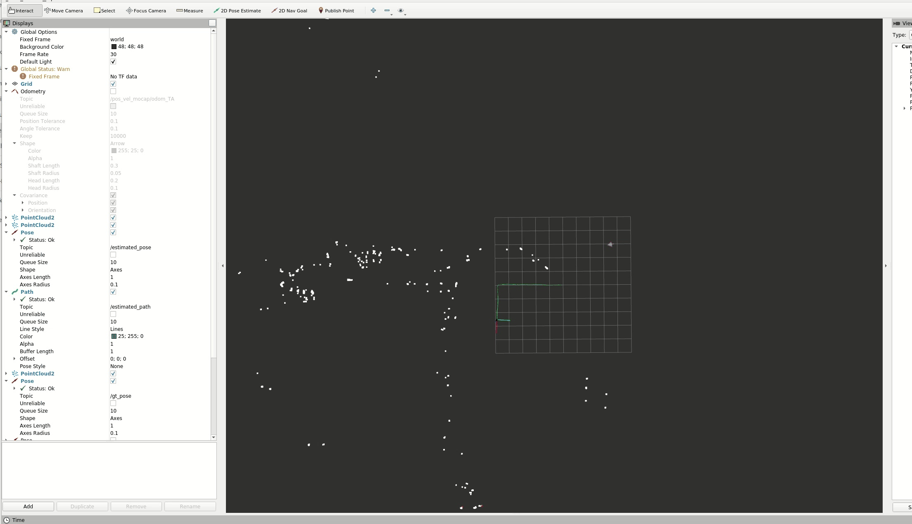

### 7.2.2. the header timestamp of radar_frame is wrong
now it is zero, not very good. 
also the frame is world, which is not appropriate for visualization.