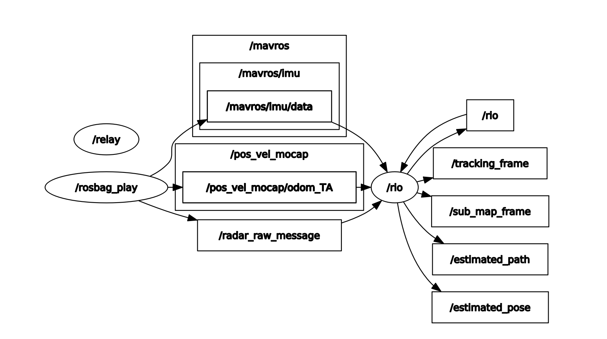

# Steps to reproduce the results
## Need docker?
###  Download the docker image by 
```
bash docker.sh -b
```
(then, it start download the file and build
```
function build() {
    docker build \
    -t rio \
    -f $SCRIPT_DIR/Dockerfile \
    $SCRIPT_DIR/..
}
```
)


### Run the docker 
```
bash docker.sh -r
```

*This starts the Docker container and attaches your terminal to it. Once the container starts successfully, the terminal will switch to being inside the Docker container.*

(mapping the current folder to docker 
```
function run() {
    docker run -it --rm \
    --network host \
    --privileged \
    -v /dev:/dev \
    -v $SCRIPT_DIR/../:/ws/src \
    -e DISPLAY=$DISPLAY \
    -v /tmp/.X11-unix:/tmp/.X11-unix \
    rio \
    /bin/bash
}
```
)

## ROS
bash 1

```
roscore &
rviz -d rio/config/RIO.rviz
```

bash 2
```
python3 /ws/src/docker/run.py -a -n rio -c /ws/src/rio/config/ars548.yaml -d /ws/src/dataset/exp/Sequence_1.bag -r 1 -p 1
```
### demo


### rqt_graph 


# Issue
## ERROR: Unable to start XML-RPC server, port 11311 is already in use (just occasionally occurs)

```
roscore -p 11312
```

```
export ROS_MASTER_URI=http://localhost:11312
```